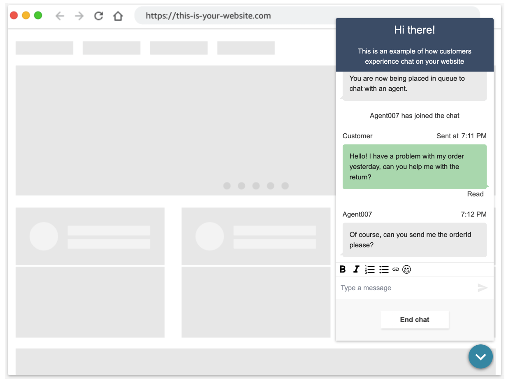

# Amazon Connect Chat Interface 
[](https://github.com/amazon-connect/amazon-connect-chat-interface/actions/workflows/node.js.yml) [](https://opensource.org/licenses/MIT) 


Amazon Connect Chat Interface is a light interface to create a customer widget for getting started with Amazon Connect chat. This package contains
some lightweight components to render chat out of the box in your website, with a thin layer on top of [ChatJS](https://github.com/amazon-connect/amazon-connect-chatjs)
to manage your chat session.



## Getting Started

An example of how you can use the `amazon-connect-chat-interface.js` bundle file in an html page is described in the [local-testing](local-testing/) folder. You can see other examples in this [GitHub repo](https://github.com/amazon-connect/amazon-connect-chat-ui-examples/tree/master/cloudformationTemplates/startChatContactAPI#prebuilt-chat-widget) as well.

#### Prerequisites

- Create an Amazon Connect Instance [[guide](https://docs.aws.amazon.com/connect/latest/adminguide/amazon-connect-instances.html)]
  - OR: enable chat experience for an existing Connect instance. [[guide](../README.md#enabling-chat-in-an-existing-amazon-connect-contact-center)]

- Create an Amazon Connect Contact Flow, ready to receive chat contacts. [[guide](https://docs.aws.amazon.com/connect/latest/adminguide/chat.html)]

    - Note the `instanceId` [[guide](https://docs.aws.amazon.com/connect/latest/adminguide/find-instance-arn.html)]
    - Find the `contactFlowId` for the ["Sample Inbound Flow (First Contact)"](https://docs.aws.amazon.com/connect/latest/adminguide/sample-inbound-flow.html) [[guide](https://docs.aws.amazon.com/connect/latest/adminguide/find-contact-flow-id.html)]

- Deploy a custom Amazon Connect Chat backend. [Refer to this backend template](../cloudformationTemplates/startChatContactAPI/README.md)

    - Deploy a StartChatContact template Lambda [[CloudFormation Template](https://github.com/amazon-connect/amazon-connect-chat-ui-examples/tree/master/cloudformationTemplates/startChatContactAPI)]
    - Add the `region`, `API_GATEWAY_ID`, `contactFlowId`, and `instanceId` to `endpoints.js`.

#### Additional References

- [StartChatConact API Backend (CFN Template)](https://github.com/amazon-connect/amazon-connect-chat-ui-examples/tree/master/cloudformationTemplates/startChatContactAPI)
- [Custom Chat Widget Example App](https://github.com/amazon-connect/amazon-connect-chat-ui-examples/tree/master/customChatWidget)
- [Amazon Connect Chat Experience Admin Guide](https://docs.aws.amazon.com/connect/latest/adminguide/enable-chat-in-app.html)
- [Amazon Connect Open Source Documentation](https://docs.aws.amazon.com/connect/latest/adminguide/download-chat-example.html)
- [Out-of-box Amazon Connect Chat Widget Setup](https://docs.aws.amazon.com/connect/latest/adminguide/add-chat-to-website.html)

## Documentation

### - [Features](./DOCUMENTATION.md#features) - details on how to enable/use various features

### - [Customization](./DOCUMENTATION.md#customization) - overview of global configuration options (logger, feature flags, etc)

### - [Components](./DOCUMENTATION.md#components) - high level overview of some of the major components

## Usage

Importing the `amazon-connect-chat-interface.js` bundle file into your project will place a `ChatInterface` object on the window, which contains a method to `initiateChat`.
To initiate the chat, you will pass in some details about your Connect instance, the requesting user, and the API Gateway generated 
via the [getting started process](https://github.com/amazon-connect/amazon-connect-chat-ui-examples/tree/master/cloudformationTemplates/startChatContactAPI#prebuilt-chat-widget).

Similar to the [`local-testing/`](./local-testing) folder, import the `amazon-connect-chat-interface.js` bundle file and invoke the global connect methods:

```html
<html>
    <head>
        <title>Amazon Connect Chat Interface Local Test</title>
        <meta name="viewport" content="width=device-width, initial-scale=1">
        <meta http-equiv="Content-Type" content="text/html; charset=utf-8" />
        <script src="amazon-connect-chat-interface.js"></script>
    </head>
    <body>
        <div>
            <h1>Amazon Connect - Custom Implementation of Customer Chat</h1>
            <button id="startChatBtn">Launch Chat</button>
            <section class="section-chat" id="section-chat" style="float: right; width: 50%;">
                <div id="root"></div>
            </section>
        </div>
        <script>
            // CONFIGURATION
            var rootElemId = 'root'; // This is the id of the container where you want the widget to reside
            var customerName = 'Satoshi'; // can also be submitted in a form
            
            // BACKEND ENDPOINTS
            var apiGatewayEndpoint = `https://asdfasdf.execute-api.us-west-2.amazonaws.com/Prod/`; // REPLACE ME
            var region = 'us-west-2' // REPLACE ME
            var contactFlowId = '7d67abd3-06ae-4170-9d3b-7b5031caf208'; // REPLACE ME
            var instanceId = '3203af10-3e0d-4d59-9452-6543250cf7f6'; // REPLACE ME
            
            (function () {
              // Initialize the chat widget
              connect.ChatInterface.init({
                containerId: rootElemId // This is the id of the container where you want the widget to reside
              });
            
              document.getElementById('startChatBtn').addEventListener('click', function (e) {
                e.preventDefault();
            
                // Launch a chat
                connect.ChatInterface.initiateChat({
                  name: customerName,
                  region,
                  apiGatewayEndpoint,
                  contactFlowId,
                  instanceId,
                  contactAttributes: JSON.stringify({
                    "customerName": customerName
                  }),
                  featurePermissions: {
                    "ATTACHMENTS": false,  // this is the override flag from user for attachments
                  },
                  supportedMessagingContentTypes: "text/plain,text/markdown", // enable rich messaging
                }, successHandler, failureHandler);
              });
            })();
            
            function successHandler(chatSession) {
              console.log("success!");
            }
            
            function failureHandler(error) {
              console.log("There was an error: ");
              console.log(error);
            }
        </script>
    </body>
</html>
```

## Local Development

Fork the souce code and generate a custom `amazon-connect-chat-interface.js` bundle file.

### Downloading AmazonConnectChatInterface from Github

Clone the public repository with the following command:

```
$ git clone https://github.com/amazon-connect/amazon-connect-chat-interface.git
$ cd amazon-connect-chat-interface
$ npm install
$ npm run release
```

### Development Build

To make local modifications to this package and test them on your webpage, simply make your edits and run `npm install && npm run dev-build` to produce the
Webpack built file and the sourcemaps. This generates the `amazon-connect-chat-interface.js` bundle file, which can be imported in `local-testing/index.html`.

Optionally, run `npm run dev-watch` to auto-rebuild the bundle file during development.

### Production Build

To build the production version of this package, simply run `npm install && npm run build`. These will generate a minified built file, with console logs stripped and other Webpack optimizations.
Import this into your package as is described in the GitHub examples.

## Specifications

 - Supported Browsers: refer to [Admin Guide Documentation](https://docs.aws.amazon.com/connect/latest/adminguide/connect-supported-browsers.html)
 - NodeJS: `NodeJS LTS v16.x` (for local development) [see [CI worklow](https://github.com/amazon-connect/amazon-connect-chat-interface/actions/workflows/node.js.yml)]
 - Webpack: `webpack@v4`
 - React: `react@16`

### Web Accessibility Standards

This example repository aims to follow web accessibility standards, but does not guarantee a specific level of WCAG compliance (e.g. WCAG 2.0 AA). Team currently has internal accessibility auditing for the Amazon Connect OOTB Hosted Widget [[Learn More](https://docs.aws.amazon.com/connect/latest/adminguide/add-chat-to-website.html)].

## Troubleshooting and Support

Review the resources given in the README and use our [documentation](./DOCUMENTATION.md) for guidance on how to develop on this library. Additionally, search our [issues database](https://github.com/amazon-connect/amazon-connect-chat-interface/issues) to see if your issue is already addressed. If not please cut us an [issue](https://github.com/amazon-connect/amazon-connect-chat-interface/issues/new/choose) using the provided templates.

If you have more questions, or require support for your business, you can reach out to [AWS Customer support](https://aws.amazon.com/contact-us). You can review our support plans [here](https://aws.amazon.com/premiumsupport/plans/?nc=sn&loc=1).

## License

This project is made available under the MIT-0 license. See the LICENSE file.

Copyright Amazon.com, Inc. or its affiliates. All Rights Reserved.